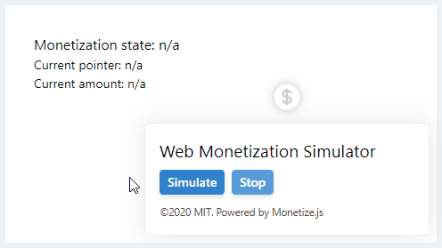

### Monetize.js


[](https://github.com/sunchayn/monetize.js/actions)
[](https://coveralls.io/github/sunchayn/monetize.js?branch=master)

[](./LICENSE)

Monetize.js is an Event-driven library that serves as a wrapper and simulator for Web Monetization API.

## Features

- Flexible pointers management (Static and Dynamic).
- Promise-like syntax to watch events.
- Customizable cycle-through a list of pointers.
- Supports probabilistic cycle-through a list of pointers.
- Calculates the total amount grouped by currency.
- Powerful simulator that works without iframe or installed extension.

## Installing Monetize.js

Using npm

```
npm install monetize

// Using it
const monetize = require('monetize');
```

Using unpkg CDN:

```html
<script src="https://unpkg.com/monetize@latest/dist/monetize.js"></script>
```

## Examples
Multiple examples has been created using monetize.js you can find them in this [examples](https://github.com/sunchayn/monetize.js/tree/master/examples) folder.

## Monetize.js API

As soon as you import Monetize.js it will start observing the head tag to see if there's a pointer to pick.

### Watching Monetization events

You can simply start using static mode by manually adding the payment pointer to the head tag:

```html
<head>
...
<meta
    name="monetization"
    content="$wallet.example.com/alice"
>
...
</head>
```

Then in your code you can listen to the different event using

```javascript
monetize.when('start').then((event) => {
    // Your event listener logic here.
});

monetize.when('progress').then((event) => {
    // Your event listener logic here.
});
```
*Note: This is not a promise.The chained `then` here will be called multiple time as long as the `monetizationstart` event is fired.*

#### Event mapping

| Monetize.js event 	| Original event       	|
|-------------------	|----------------------	|
| start             	| monetizationstart    	|
| progress          	| monetizationprogress 	|
| pending           	| monetizationpending  	|
| stop              	| monetizationstop     	|

You can learn more about the event object passed to each event from the list by exploring [Monetization Javascript API](https://webmonetization.org/docs/api#browser-events) documentation.

#### Custom events
The library is aimed to support custom event too. For now it supports the following custom event:

| Event                	| Description        	|
|-------------------	|----------------------	|
| pointer_changed      	| Fired when a new pointer has been detected in the head.    	|

### Dynamic pointers
The library provide multiple ways for dynamic pointer configuration:

#### Single Pointer

```javascript
// Encapsulated mode
const p = '$alice.example';

monetize.pointer(p).then((watcher) => {
    // monetizationstart event has been fired.

    // Get the `monetizationstart` event object detail
    const { paymentPointer, requestId } = watcher.event.detail

    // If you would like to verify the session id in the back end. You will need to do it here
    verifySession(paymentPointer, requestId)

    watcher.when('progress').then((event) => {
        // You can verify the payment here
        if (! verifyPayment(event.detail)) {
            doNotVerifiedLogic();
            return;
        }

        // Your event listener logic.
    });
});

// Free mode
monetize.when('start').then((event) => {
    // your logic here
});

monetize.when('progress').then((event) => {
    // your logic here
});

monetize.pointer(p);
```

if no pointer has been provided or the Monetization API is disabled an error will be thrown that you can catch via `catch` method:

```javascript
monetize.pointer('')
.then(...)
.catch((error) => {
    console.log(error.message);
});
```
*Note: You can omit `then` and shortcut to catch directly.*

**Only add the meta tag**

if you wish to change or just add a pointer to the meta tag without the extra encapsulation you can just call `set` method.

```javascript
monetize.set('$example');
```

*Note: this method won't perform any extra validation it will add the passed value as it is. Passing invalid value would interrupt the payment process.*

#### Multiple Pointers

If you have a list of pointer to chose from you can use the `pluck' method to randomly pick a pointer from the list.

```javascript
const pointers = [
    '$alice.example',
    '$connie.example',
    '$bob.example'
];

// Randomly picking a pointer.
monetize.pluck(pointers)

// Or using encapsulation.
monetize.pluck(pointers).then(...)

// Error aware encapsulation.
monetize.pluck(pointers).then(...).catch(...);
```

If you would like to assign a probabilty for each pointer you can do that by passing an `object` to `pluck` function like the example below:

```javascript
// Probability for each pointer. Must sum to 1
const pointers = {
  '$alice.example': 0.6,
  '$bob.example': 0.05,
  '$connie.example': 0.30,
};

// Randomly picking a pointer.
monetize.pluck(pointers)

// Or using encapsulation.
monetize.pluck(pointers).then(...)

// Error aware encapsulation.
monetize.pluck(pointers).then(...).catch(...);
```

#### Cycle through Pointers
Sometimes picking a single pointer on page load isn't enough. For thing case, you may consider using `cycle` and `probabilisticCycle` to cycle through a list of `pointers` for a given `timeout`

**Cycle**

```javascript
  /**
   * Sequentially cycle through the given pointers.
   * @param {string[]} pointers list to pick from.
   * @param {number} timeout how often the pointer should be changed.
   * @param {function} callback an optional callback to control how a pointer is chosen. It must return a pointer otherwise it will be ignored.
   * @returns {PromiseLoop}
   */
  cycle(pointers, timeout = 3000, callback);
```

the following example illustrate how to use it:

```javascript
    const pointers = [
      '$wallet',
      '$wallet2',
      '$wallet3',
    ];

    // Simple usage.
    monetize.cycle(pointers, 5000);

    // Use `then` to listen for the first pointer `monetizationstart` event.
    monetize.cycle(pointers, 5000).then(...).catch(...);
```

**probabilisticCycle**

`probabilisticCycle(pointers [, timeout])`

the following example illustrate how to use it:

```javascript
    const pointers = {
      '$alice.example': 0.6,
      '$bob.example': 0.05,
      '$connie.example': 0.30,
    };

    // Simple usage.
    monetize.probabilisticCycle(pointers, 5000);

    // Use `then` to listen for the first pointer `monetizationstart` event.
    monetize.probabilisticCycle(pointers, 5000).then(...).catch(...);
```

**⚠ Important**

Only one cycle-through is allowed. Hence always the last list will be used.

Consider the following code in a single page:
```javascript
    monetize.cycle(pointers1, 2000);
    monetize.probabilisticCycle(pointers2);
    monetize.cycle(pointers3);
    monetize.probabilisticCycle(pointers4, 4000);
```

The library will only cycle through `pointers4` list.

**Example**

### State checking

You can at any time check for the monetization status by calling:

| Method      	| Description                                                        	|
|-------------	|--------------------------------------------------------------------	|
| isEnabled() 	| Check if the Monetization API is supported by the current browser. 	|
| isSending() 	| Check if there's a monetization stream going on.                   	|
| isStopped() 	| Check if the service is idle.                                      	|
| isPending() 	| Check if the service is waiting for the first payment.             	|

### Add state classes
You can use monetize.js to add different classes to the `body` tag. To do so you need to use the `setup` method to override the default config and enable the classes.

```javascript
monetize.setup({
    addClasses: true,
});

// it's possible to chain it with other methods
monetize.setup({ ... }).pointer('$test').then(...);
```

**Available classes**

| Class name               	| Description                                         	|
|--------------------------	|-----------------------------------------------------	|
| js-monetization-disabled 	| Added when the API is not supported in the browser. 	|
| js-monetization-enabled  	| Added when the API is supported in the browser.     	|
| js-monetization-pending  	| Added when the state is `pending`                   	|
| js-monetization-stopped  	| Added when the state is `stopped`                   	|
| js-monetization-sending  	| Added when the state is `started`                   	|

**Override the default classes**

To override the default classes you will need to send an extra property for the setup method:

```javascript
const config = {
    addClasses: true,
    classes: {
        disabled: 'js-monetization-disabled',
        enabled: 'js-monetization-enabled',
        pending: 'js-monetization-pending',
        stopped: 'js-monetization-stopped',
        sending: 'js-monetization-sending',
    },
}

monetize.setup(config);
```

### Amount API
The `monetize` object leverage an extra API that keeps track of the streamed amount.

The following is basic example on how to get the total streamed amount and currency for a given pointer.

*Note: to use Amount API you must use one of these methods first: `pointer`, `pluck`, `cycle` or `probabilisticCycle` to setup the basic infrastructure for the API.

```javascript
const pointer = '$example';

monetize.pointer(pointer);

// Get the Raw amount sent.
const amount = monetize.amount.getPointerTotal(pointer);
// => output: 5258

// Or get the Formatted amount
const amount = monetize.amount.getPointerTotal(pointer, true);
// => output: 0.035

// Get the currency
const currency = monetize.amount.getPointerCurrency(pointer);
```

#### Dealing with multiple pointers
If your page is using multiple pointers at the same time you can get the total streamed amount grouped by currency using `total` method:

```javascript
monetize.cycle(...);

// Raw total
const total = monetize.amount.total()

// Formatted total
const total = monetize.amount.total(true)

/*
Example returned value.
{
    usd: 5825,
    XRP: 8875,
}
*/
```
*Note: if all pointers have the same currency the amount of that currency will be returned instead.*

## Simulator
Beside the core library, a powerful Web Monetization simulator is shipped. It does not require any extension installed or to be executed inside an iFrame.

An example for simulator in action.



### How to use

If installed using npm

```javascript
const monetize = require('monetize');
const simulator = require('monetize/dist/simulator');
```

Or using a CDN

```html
<!-- Core library -->
<script src="https://unpkg.com/monetize@latest/dist/monetize.js"></script>

<!-- Simulator -->
<!-- The simulator uses the core library hence it must be called after it. -->
<script src="https://unpkg.com/monetize@latest/dist/simulator.js"></script>
```

All what you need is calling the simulator script. It will take care of the rest.

### Payment states

The simulator has 4 states showed in the dollar sign icon.

- Gray: Unknown state.
- Orange: Pending state.
- Green: Sending payments sate.
- Red: Stopped state.

### How it work
The reason why the simulator it does not require a payment provider extension or be run in a iFrame is due the fact that it mock the Monetization API when it's not supported.

## Contributing to Monetize.js

To contribute to Monetize.js, follow these steps:

1. Fork this repository.
2. Create a branch: `git checkout -b <branch_name>`.
3. Install all the dependencies: `npm install`
4. Make your changes and commit them: `npm run commit` [ [see below](#commits-convention) ]
5. Push the changes to your fork: `git push`
5. Create the pull request.

### Commits convention
The project uses [semantic releases](https://github.com/semantic-release/semantic-release) to automatically push new releases. Hence a set of convention has been established. Committing your changes through the `npm run commit` command will walk you through the commit content structure that you need to create.

### Commit hooks
Before adding a commit two verification will take place:

- Linting using Eslint.
- Testing using Jest.

Both of them have to succeed in order to validate the commit.

## License
This project is licensed under the [MIT Licence](https://github.com/sunchayn/monetize.js/blob/master/LICENSE).

---
Copyright (c) 2020 [Mazen Touati](https://sunchayn.github.io)
